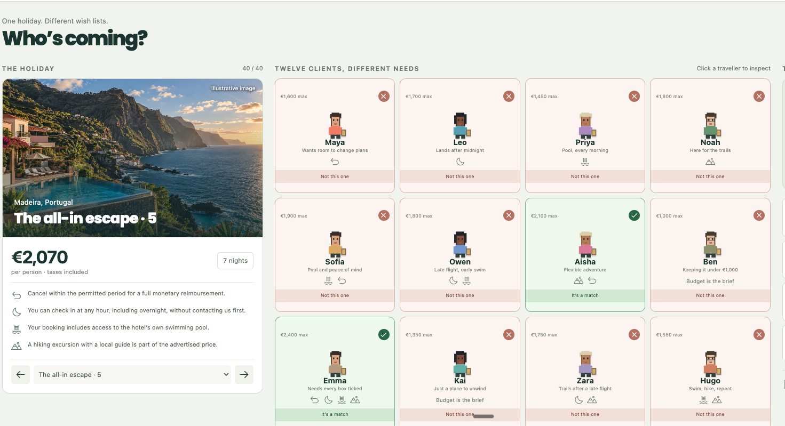
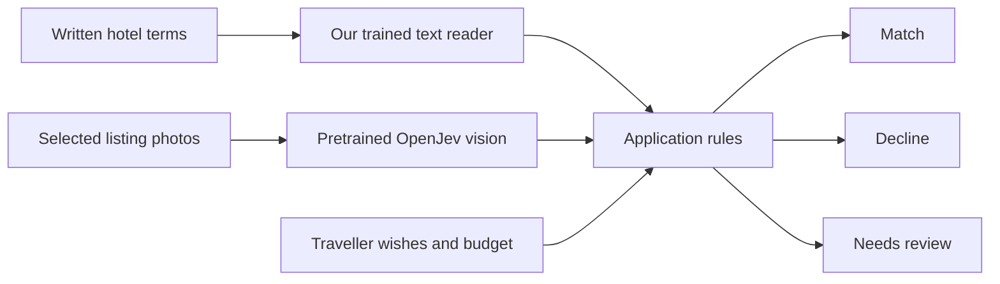
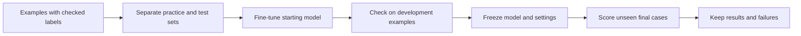

# Away Together

### Build a local decision system you can understand.

**Created and assembled by Mark Kashef at Prompt Advisers.** A working travel demo, a visual teaching page, and the experiments behind them. The system reads written terms, looks at photos, and checks each traveller’s wish list.



The familiar persona interface remains the core demo. Each card can expose the written clause or photo behind its result.

> **The honest result:** our later text challenger scored 95.28% against synthetic travel reference answers; Jev scored 98.61% on the same test. The challenger was not promoted. The live demo still uses the earlier V1 reader, which scored 66.5% on its separate older test. This is an experimental learning project, not a booking service.

## Start with the idea

A model makes a small judgment. Your application decides what to do with it.



The visual model receives image pixels. It does not receive filenames, destination captions, generated-image prompts or expected answers. Photos can establish visible features. They cannot establish booking terms, free access or a complete step-free route.

## Follow the complete build

Use the [A–Z tutorial](docs/STEP-BY-STEP.md) to choose and download the starting classifier, copy the [complete Codex prompt](prompts/TRAIN-MY-SPECIALIST.md), measure a baseline, train in a separate workspace, test both models, and run a new prediction. The tutorial tool preserves the supplied app. Its smoke run verifies the commands; it does not establish model quality.

## First run

Start with [START-HERE](START-HERE.md): install, restore weights, check prerequisites, and run one real result before changing the task. The 29-scene explainer includes an example exporter, photo upload lab and 24 plain-English answers. See the [audience checklist](docs/AUDIENCE-CLOSURE-CHECKLIST.md) for verified coverage and the launch-stage public access check.

## Choose a reading path

- **New to machine learning:** read the everyday explanation, use the glossary, then explore the site without loading a model.
- **Want a working app:** follow START-HERE and setup, run one saved model result, then try the API example.
- **Want your own task:** run travel first, then follow adaptation and keep a separate test.
- **Want to audit the claims:** start with reproducibility, benchmarks and provenance.

## Pick your path

| I want to… | Start here |
|---|---|
| Understand it without ML knowledge | [Plain-English walkthrough](docs/HOW-IT-WORKS.md) and [glossary](docs/GLOSSARY.md) |
| Follow the request through the code | [Architecture and decision rules](docs/ARCHITECTURE.md) |
| Fix a failed first run | [Troubleshooting](docs/TROUBLESHOOTING.md) |
| Verify or reproduce the work | [Reproducibility guide](docs/REPRODUCIBILITY.md) |
| Run the web explainer | `python3 apps/explainer/serve.py`, then localhost:8770 |
| Run the actual local models | [Setup guide](docs/SETUP.md) |
| Adapt it to my own task | [Repurposing guide](docs/ADAPT-YOUR-OWN.md) |
| Inspect the measurements | [Evidence guide](docs/BENCHMARKS.md) |
| Record the walkthrough | [Filming guide](docs/FILMING-GUIDE.md) |
| See exactly what Mark built | [Contributions and upstream tools](docs/CONTRIBUTIONS.md) |

The explainer’s diagrams and interactions work alone. Its opening **live** check needs the agency on 8765 and vision on 8081. It never substitutes a saved answer when services are unavailable.

## Repository map

```text
apps/
  agency/                 Python inference + React persona interface
    travel_lab/           Text inference, photo observations, app rules
    config/               Questions and destination photo sets
    data/                 Training and evaluation inputs
    experiments/          Reproduction code and pinned vision source
    scripts/              Training, evaluation, launch and verification
    app/                  Pixel travellers, evidence cards, shortlist
  explainer/              Separate scroll-snap filming website
    frames/               Three active HyperFrames diagrams; teaching source retained
    assets/               Local fonts, images and animation runtime
docs/                     Setup, diagrams, adaptation and filming
evidence/                 Scores, result summaries and integration receipts
```

Large checkpoints and full raw experiment history live in the private companion release, outside Git. Vision weights are separately downloaded from their pinned upstream revision. Runtime environments, credentials and local caches are excluded.

## How the reader learns



**Fine-tuning** means giving an existing model more practice on one specific task. We change its saved settings using labeled examples. **Multimodal** means the application uses words and pictures. These are separate ideas; we trained a text reader and integrated an already-trained photo reader.

## What ran

- Real local OpenJev/DiffusionGemma image inference on nine fictional destination photos.
- Six additional photos, with three images per destination shared across 40 offers.
- Actual causal check: same written terms; stairs photo included makes Maya decline, removing it makes her require review.
- Forty fresh photo-aware offer requests completed in 40.7 seconds on the recorded machine/run. This is an integration smoke test, not a general speed or accuracy benchmark.
- Python 62 tests plus 4 subtests and frontend 4 tests passed before this repository export. See evidence for the exact verification scope.

## Costs and requirements

No model-provider API fee is incurred by local inference. Hardware, electricity, installation and maintenance still cost something. There is no measured claim that this system costs a fixed fraction of an LLM. The supplied photo backend uses Apple silicon and a roughly 16 GB download, in addition to text-model resources.

## Ownership and credits

Mark designed the travel task and product experience, directed the model experiments, assembled the application, integrated image evidence, and created the reusable explanation and resource. Development used AI coding tools. The underlying pretrained models and libraries have their own authors and terms. OpenJev is an upstream integration, not an original model invented here. See [contributions](docs/CONTRIBUTIONS.md) and [third-party notices](THIRD-PARTY-NOTICES.md).

One repository: private during preparation, public when the video goes live. Until launch, sharing the URL does not grant viewer access. No general open-source license is granted for original project code at this stage; upstream components retain their own licenses.


## What is ready, and what is still experimental?

| Area | Status |
|---|---|
| Local travel app and persona UI | Working demonstration with real inference; reliability limits remain |
| 29-scene teaching site, Q&A and guide | Implemented and checked at four viewport sizes |
| Photo upload lab | Working local observation; does not modify the saved catalogue |
| Support example editor/converter | Working data preparation; not a trained support model |
| Windows/Linux image backend and minimum RAM | Not validated |
| Public download | Scheduled for video go-live using this same repository |
| Original-code reuse license | Not yet granted; component terms remain in force |

The [verification receipts](evidence/audience-revision/AUDIENCE-REVISION-VERIFICATION.md) distinguish source checks, application tests, visual inspection and model observations. A passed interface test is not proof of model accuracy.
