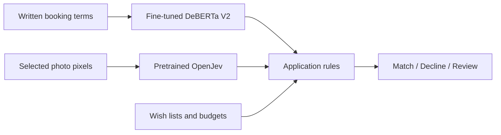

<div align="center">

# Your own specialist. Running on your computer.

**Away Together** · A working example from **Early AI Adopters**

Train a small model for one job. See its mistakes. Put its answers to work.

[Explore the visual guide](https://build-your-own-jev.markkashef.chatgpt.site) · [Try the sample agency](https://build-your-own-jev.markkashef.chatgpt.site/demo/) · [Build your own](prompts/TRAIN-MY-SPECIALIST.md)


</div>

A hotel promises a “flexible booking.” Does that mean cash back, hotel credit, or nothing you can safely conclude?

This project turns that question into a complete learning loop: define the labels, measure a starting model, train a specialist, test it on unseen examples, and connect the result to an application. The example is a fictional travel agency. The method is yours to adapt.

**The AI reads the holiday. It does not classify the people.** One model reads the written terms, a separate model reads the photos, and ordinary code compares those observations with each traveller’s wish list and budget.

## Try it before installing anything

Open the **[sample agency](https://build-your-own-jev.markkashef.chatgpt.site/demo/)**. Choose a holiday, change a budget, toggle a requirement, or remove a photo. Inspect the reason behind each match, decline and review.

The public sample contains **recorded outputs from the real local models** for 40 fictional offers and nine photos. Application rules run in your browser. It does not run a model, analyze new text, or upload your images. The [local app](docs/SETUP.md) performs fresh inference.

For the clearest example, choose **The flexible escape · 2**. Maya wants a cash refund and to avoid entrance stairs. Including the stairs photo produces a decline. Removing it produces **needs review**, because an unseen staircase is not proof of an accessible route.

## What actually improved?

| Text reader | Agreement with reference answers |
|---|---:|
| Our earlier V1 | 60.28% |
| **Our local V2, active in the app** | **95.28%** |
| Jev | 98.61% |

Same 360 synthetic travel scenarios, 1,440 decisions per model. These are reference-agreement scores, not human-verified booking accuracy. **V2 improved by 35 percentage points over V1 and did not beat Jev.** Its travel specialization does not establish general-purpose parity.

V2 runs because it passed the app’s quality and coverage gates. The stricter Jev-superiority gate was not passed. The image branch is separate and is not included in this text score. [Inspect the evidence and limitations →](docs/BENCHMARKS.md)

## Three ways in

| Your goal | Your next step |
|---|---|
| Understand the idea | [Visual walkthrough](https://build-your-own-jev.markkashef.chatgpt.site) and [plain-English guide](docs/COMMUNITY-GUIDE.md) |
| Run the same local system | [Setup](docs/SETUP.md), current `companion-v2` assets, then one fresh check |
| Train for your own job | [Copy the complete prompt](prompts/TRAIN-MY-SPECIALIST.md), edit the bracketed fields, and follow the [A–Z tutorial](docs/STEP-BY-STEP.md) |

### Ask your coding assistant to help

```text
Set up https://github.com/earlyaidopters/away-together on my computer.
Read the README and docs/SETUP.md first. Check my hardware and prerequisites.
Use the current companion-v2 release and verify its manifest.
Launch the text app and run one real holiday check. Show the model output.
Then explain whether my machine can support the optional image backend.
Do not retrain, replace checkpoints, or make paid API calls during setup.
```

Use Claude, Codex, or another coding assistant with local filesystem and terminal access. A chat-only answer is not proof that a model ran.

## Run locally

**Tested:** macOS 26.5.2 on an Apple M5 Max with 128 GB RAM. That is the tested host, not a minimum requirement. Start with the text path. The optional image path currently targets Apple silicon and downloads roughly 16 GB; Windows/Linux vision and lower-memory hosts are unvalidated.

Prerequisites: Python 3.12, `uv`, Node 22+, npm, Git, and GitHub CLI for the download command. You can also download the ZIP from [Releases](https://github.com/earlyaidopters/away-together/releases).

```bash
git clone https://github.com/earlyaidopters/away-together.git
cd away-together
gh release download companion-v2 --repo earlyaidopters/away-together \
  --pattern Away-Together-Complete.zip --dir downloads
python3 tools/restore_companion.py downloads/Away-Together-Complete.zip
cd apps/agency
uv sync --frozen
npm --prefix app ci
npm --prefix app run build
uv run uvicorn travel_lab.serve:app --host 127.0.0.1 --port 8765
```

Open **http://localhost:8765**. Check a holiday and inspect its receipt. The first request loads the model. Keep the service on loopback; this local development server is not a public deployment.

To add the separate photo model, open another terminal in `apps/agency`:

```bash
uv run python scripts/start_vision.py --setup --background
```

To run the no-model sample yourself:

```bash
cd apps/public-demo
npm ci
npm run dev
```

[Setup details](docs/SETUP.md) · [Troubleshooting](docs/TROUBLESHOOTING.md) · [Architecture](docs/ARCHITECTURE.md)

## How the pieces fit



The photo model can report visible stairs or a pool. It cannot establish included access, refund rights, or a complete step-free route. Missing evidence remains a review. Budgets are arithmetic, not model guesses.

## Make it useful for your own job

1. **Choose a narrow decision.** Define what goes in and the exact answers allowed out. Include “can’t tell.”
2. **Write the label rules.** Check ambiguous examples yourself before creating thousands more.
3. **Separate practice from the exam.** Keep related documents and templates in one split. Reserve a final test.
4. **Measure before training.** Compare the starting model and simple rules. Fine-tuning may not be necessary.
5. **Run a small experiment.** Save the configuration, data version and model hash. Use development results to choose a checkpoint.
6. **Freeze, then test.** Keep every mistake. Do not keep tuning against the same “unseen” exam.
7. **Connect it carefully.** Keep application rules inspectable and route uncertain cases for review.

The [complete prompt](prompts/TRAIN-MY-SPECIALIST.md) walks your assistant through this process. The tutorial creates a separate workspace and preserves the supplied travel model. Its smoke test validates the pipeline, not model quality.

## Find your way around

```text
apps/agency/       Python inference, React travellers, training and evaluation
apps/explainer/    Original local visual walkthrough and image upload lab
apps/public-demo/ Browser sample using recorded model observations
prompts/           Copy-ready brief for your own specialist
docs/             Setup, adaptation, explanation and benchmark boundaries
evidence/         Historical measurements and verification receipts
tools/            Manifest-checked restore, first-run checks, training tutorial
```

Large model weights and runtime receipts live in the versioned companion release. The source repository excludes credentials, environments and caches. OpenJev model weights are downloaded separately under their upstream terms.

## What this project is honest about

- This is a learning project using fictional offers and synthetic labels, not a booking service.
- The benchmark supports a narrow travel result. It does not support “we beat Jev.”
- Text fine-tuning and pretrained image inference are separate systems joined by code.
- Local inference avoids per-request model-provider charges; hardware, energy, storage and development still cost money.
- The original build used Codex. Claude Opus helped with later upgrades. Neither tool replaces your judgment about the examples.
- The public sample is a replayable demonstration. Run locally for fresh inference.

## Build with us

Created by **Mark Kashef**, shared through **[Early AI Adopters](https://www.skool.com/earlyaidopters/about)**. Bring your own task, compare results, and share what failed as well as what worked.

[Contributing](CONTRIBUTING.md) · [Report a bug](https://github.com/earlyaidopters/away-together/issues) · [Credits](THIRD-PARTY-NOTICES.md)

**License:** original project code is [MIT](LICENSE). Upstream code, models, datasets and fonts retain their own licenses. This project is independent and is not affiliated with or endorsed by TypeSafe, Jev, Anthropic, OpenAI, or the upstream model authors.
