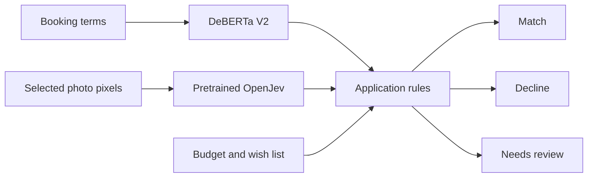
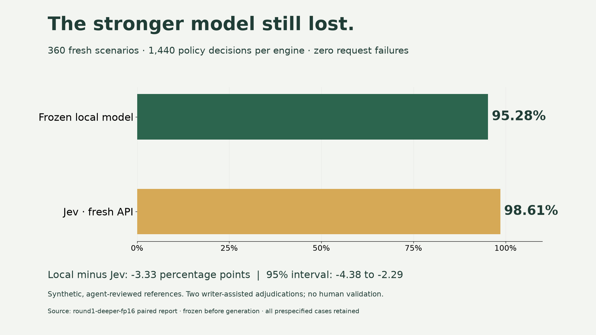

<div align="center">

# Away Together

**The complete local AI build · Early AI Adopters community edition**

From a booking clause to a decision you can inspect.

[Run the local app](#run-the-local-app) · [Inspect the results](#what-the-experiment-actually-showed) · [Train for your task](#make-your-own-specialist) · [Public starter](https://github.com/earlyaidopters/away-together-starter)

</div>


A holiday looks perfect. The refund is hotel credit, the pool costs extra, and the entrance has stairs. Different travellers care about different details.

**Away Together reads the holiday’s terms and photos, then checks them against each traveller’s requirements.** The AI produces narrow observations. Application code handles budgets and combines the evidence into **match**, **decline**, or **needs review**.

This is the complete project behind Mark’s video: the working local app, text training code, separate image integration, frozen V2 checkpoint, and measurements you can inspect. The fictional travel task is the example; the build-and-test process is the part to reuse.

> **Member access:** this repository and its releases require an authorized GitHub account. The [public starter](https://github.com/earlyaidopters/away-together-starter), [visual guide](https://build-your-own-jev.markkashef.chatgpt.site) and [recorded sample](https://build-your-own-jev.markkashef.chatgpt.site/demo/) remain available to everyone. Skool membership does not automatically sign you into GitHub.

## Pick your first session

| Your goal | Follow this path | Finish with… |
|---|---|---|
| Run the system from the video | [Local setup](#run-the-local-app) | One fresh V2 prediction and an inspectable receipt |
| Understand a decision | [Follow one request](#follow-one-request-through-the-code) | The clause, model answer and rule behind a result |
| Audit the experiment | [Results](#what-the-experiment-actually-showed) → [reproducibility](docs/REPRODUCIBILITY.md) | The test scope, saved evidence and known failures |
| Build for your own domain | [Complete prompt](prompts/TRAIN-MY-SPECIALIST.md) → [adaptation guide](docs/ADAPT-YOUR-OWN.md) | A separate experiment with a held-out test |

You do not need to rerun training to use the supplied model. Start with inference; explore the historical experiments afterward.

## What is in this edition?

| Component | What you receive |
|---|---|
| **Local agency** | React persona interface, Python API, 40 fictional offers and 12 travellers |
| **Text specialist** | Active DeBERTa V2 checkpoint, immutable freeze and selection evidence in `companion-v2` |
| **Photo reader** | Pinned OpenJev integration; vision weights downloaded separately |
| **Training and evaluation** | Historical experiments, protocols, comparison code and inspectable receipts |
| **Teaching material** | Visual walkthrough, full build prompt, setup and adaptation guides |
| **Browser sample** | A no-model version using saved observations and browser rules |

The browser sample is recorded. The local agency runs fresh inference. The educational ModernBERT tutorial is a separate recipe from the historical V2 experiment.

## Run the local app

### 1. Check access and prerequisites

Use **Python 3.12, uv, Node 22+, npm, Git and GitHub CLI**. Sign in with the GitHub account that has community repository access:

```bash
gh auth status
gh repo view earlyaidopters/away-together
```

If the repository is not visible to that account, resolve access before installing dependencies. Get help through the [community](https://www.skool.com/earlyaidopters/about).

**Tested host:** Apple M5 Max, 128 GB RAM, macOS 26.5.2. This is the machine used, not a minimum specification. The current text ZIP is approximately **1.15 GB**; allow additional space for extraction and dependencies. The optional image model adds approximately **16 GB** of downloads and uses Apple silicon. Lower-memory hosts and Windows/Linux vision have not been validated.

### 2. Clone and restore the V2 runtime

```bash
gh repo clone earlyaidopters/away-together
cd away-together
gh release download companion-v2 --repo earlyaidopters/away-together \
  --pattern Away-Together-Complete.zip --dir downloads
python3 tools/restore_companion.py downloads/Away-Together-Complete.zip
```

The restore tool validates every archive path and manifest hash before writing. It preserves existing files and refuses conflicting copies. Use a clean clone if an older installation conflicts.

**Expected:** the checkpoint appears at `apps/agency/experiments/v2/models/deberta-travel-deeper-fp16/`, and `apps/agency/models/active-model.json` selects it. Use `companion-v2`; the earlier companion supplied V1.

### 3. Start the text app

```bash
cd apps/agency
uv sync --frozen
npm --prefix app ci
npm --prefix app run build
uv run uvicorn travel_lab.serve:app --host 127.0.0.1 --port 8765
```

Open **http://localhost:8765** and leave that terminal running. Switch to **Terms only**, then click **Check this holiday**. The first request loads the model; later requests are warmer.

**Your first success:** a fresh run produces traveller decisions, clicking a traveller reveals the supporting reasons, and a receipt appears in `apps/agency/runs/demo/`. Photo preferences can still require review when photos are disabled. A loaded page alone does not prove inference ran.

### 4. Add the photo model when you are ready

In a **second terminal**, from the cloned repository root:

```bash
cd apps/agency
uv run python scripts/start_vision.py --setup --background
```

The launcher creates a separate vision environment and downloads the pinned pretrained model. It does not train a vision model. Review the [upstream terms](THIRD-PARTY-NOTICES.md).

In the app, select **The flexible escape · 2** and enable **Terms + photos**. Include all three photos and check Maya: the entrance stairs cause a decline. Remove the **Approach** photo and check again: the result becomes **needs review**. Missing evidence cannot establish a step-free route.

For the local visual walkthrough and own-photo lab, open another terminal at the repository root:

```bash
python3 apps/explainer/serve.py
```

Open **http://localhost:8770**. Keep these development services bound to loopback. [Detailed setup and recovery →](docs/SETUP.md)

<details>
<summary><strong>Have Claude or your coding assistant handle setup</strong></summary>

```text
Set up the complete community repository:
https://github.com/earlyaidopters/away-together

Read README.md and docs/SETUP.md. Check GitHub access, hardware and prerequisites.
Restore companion-v2 and verify the manifest. Preserve existing work.
Launch the text app and run one real holiday check; show the saved receipt.
Then explain whether my machine supports the optional image backend.
Do not retrain, replace checkpoints, expose local services publicly,
or make paid API calls during setup.
```

Use an assistant with terminal and local-file access. Ask it to show what actually ran.

</details>

## Follow one request through the code



| Step | Open this file | Look for… |
|---|---|---|
| Select an offer and requirements | [`app/src/main.tsx`](apps/agency/app/src/main.tsx) | The request sent to `/api/decide` |
| Load the correct checkpoint | [`active_model.py`](apps/agency/travel_lab/active_model.py) | Active pointer and frozen-model verification |
| Read the terms | [`engine.py`](apps/agency/experiments/v2/engine.py) | Candidate scoring and probabilities |
| Apply budget and terms rules | [`catalogue.py`](apps/agency/travel_lab/catalogue.py) | `verdict`, including the review branch |
| Read photos and apply visual requirements | [`vision.py`](apps/agency/travel_lab/vision.py) | Visible features, thresholds and missing evidence |
| Return and save the receipt | [`serve.py`](apps/agency/travel_lab/serve.py) | Selected photos, answers, timings and per-person reasons |

The AI reads the **holiday**, not the travellers. A picture may show stairs or a swimming pool; it cannot establish refund rights, included access, or a complete accessible route. Budgets use arithmetic. [Architecture details →](docs/ARCHITECTURE.md)

## What the experiment actually showed

| Text reader | Reference agreement on the same travel test |
|---|---:|
| Earlier local V1 | 60.28% |
| **Active local V2** | **95.28%** |
| Jev | 98.61% |

**360 synthetic scenarios. 1,440 decisions per model.** V2 improved by **35 percentage points** over V1 and did **not** beat Jev. These are agreement scores against synthetic references, not human-verified booking accuracy or general-purpose model performance.



V2 runs because it passed the app’s quality and coverage gates. The stricter Jev-superiority gate was not passed. Photo inference is a separate branch and is not included in this text score. The V3 ensemble is parked and is not the active app model.

**Inspect before rerunning:** [benchmark guide](docs/BENCHMARKS.md) · [frozen V2 report](evidence/FROZEN-V2-RESULTS.md) · [reproducibility guide](docs/REPRODUCIBILITY.md).

## Make your own specialist

Use a **new workspace**, keeping the supplied checkpoint intact.

1. **Define the decision.** Write the input, allowed answers and rules for ambiguity.
2. **Check examples.** Keep synthetic labels identified. Review realistic cases yourself.
3. **Separate the exam.** Keep related documents together across train, development and final-test splits.
4. **Measure the starting point.** Compare the unchanged model and simple rules before fine-tuning.
5. **Train, select and freeze.** Select on development results; record data and model hashes.
6. **Open the final test.** Preserve predictions and mistakes. If you tune on them, use a new test afterward.
7. **Connect the result.** Validate the question schema, answer ordering and calibration before changing an application.

Start with the [complete prompt](prompts/TRAIN-MY-SPECIALIST.md) and [A–Z tutorial](docs/STEP-BY-STEP.md). The tutorial’s ModernBERT smoke run checks the pipeline; it is not a reproduction of the 95.28% V2 result. For the historical V2 process, read its [protocol](apps/agency/experiments/v2/PROTOCOL.md) before exploring [training code](apps/agency/experiments/v2/train_deberta.py).

**Do not run every experiment file in filename order.** The folder preserves separate investigations and historical runners. Some commands download large models or make paid Jev calls. [Adaptation guide →](docs/ADAPT-YOUR-OWN.md)

## Know where your work lives

| Location | Purpose |
|---|---|
| [`apps/agency/`](apps/agency) | Working local app, training and evaluation code |
| [`apps/explainer/`](apps/explainer) | Local walkthrough and photo upload lab |
| [`apps/public-demo/`](apps/public-demo) | Recorded-output browser sample |
| [`prompts/`](prompts) and [`docs/`](docs) | Build briefs, setup, explanations and adaptation |
| [`evidence/`](evidence) | Inspectable measurements and verification receipts |
| [`tools/`](tools) | Safe restoration, prerequisite checks and tutorial stages |
| `workshops/` | Your new experiments; generated locally and ignored by Git |
| [`companion-v2`](https://github.com/earlyaidopters/away-together/releases/tag/companion-v2) | Current checkpoint and runtime evidence, outside Git |

## When a first run gets stuck

| Symptom | What to check |
|---|---|
| Repository or release appears missing | `gh auth status`; confirm the signed-in account has community GitHub access. |
| No trained model is available | Restore `companion-v2`, then check the active pointer and checkpoint paths above. |
| Restore reports conflicting files | Preserve your changes and restore into a clean clone. |
| Text works but photos do not | Complete the separate Apple-silicon vision setup and start port 8081. |
| First result is slow | Model loading is separate from warm inference. Check available memory and other model processes. |
| Results look wrong | Inspect the clause, selected photos and saved receipt; keep the failing example. |

[Full troubleshooting](docs/TROUBLESHOOTING.md) · [API example](docs/API-EXAMPLE.md) · [Contribution guide](CONTRIBUTING.md)

## Verified, with a clear scope

The community release was restored into a clean source copy, its frozen V2 model loaded, and a fresh prediction, report and error examples were read successfully. The app checks passed **42 Python tests and 4 frontend tests**. The public sample’s stairs, missing-photo and budget cases were checked separately. These checks establish the tested paths, not universal hardware support or model accuracy.

Local inference has no per-request model-provider fee. Hardware, electricity, storage, setup, coding-assistant use and optional hosted benchmarks still have costs. This is an experimental learning project, not an autonomous booking system.

---

**Built by Mark Kashef for [Early AI Adopters](https://www.skool.com/earlyaidopters/about).** Share your task, a reproducible example and what you tried when asking for help. Keep customer data and credentials out of issues.

The original build used Codex; Claude Opus helped with later upgrades. OpenJev and the base models are upstream contributions. [Credits](THIRD-PARTY-NOTICES.md) · [Original-code MIT license](LICENSE). Earlier publicly distributed MIT versions retain their permissions. This project is independent of TypeSafe, Jev and the model vendors.
