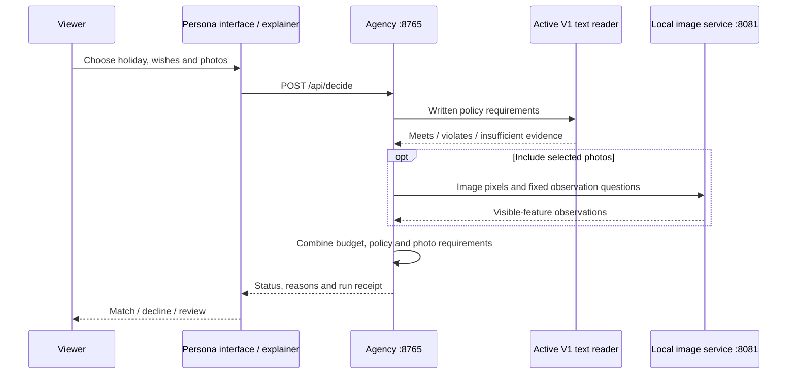

# How a request travels through the system

The app combines three separate responsibilities. A trained text model reads terms. A pretrained image model observes visible features. Application code applies the traveller's wishes and budget. There is no single model trained here to do all three.

## Decision rules

| Evidence | App outcome | Meaning |
|---|---|---|
| Any required check fails | Decline | At least one implemented requirement is not met |
| None fails, but a required check is unknown | Review | More information is needed |
| All required checks pass | Match | The implemented model/rule checks passed; not a verified booking guarantee |

For Maya, the terms and budget can pass while the entrance-stairs photo causes decline. Remove that photo and the system has less evidence: review. It has not proved that the stairs disappeared.

## Services and their boundaries

| Service | Role | Needs model weights? |
|---|---|---|
| Agency, localhost:8765 | Persona app and travel decision API | Yes for actual text inference |
| Vision, 127.0.0.1:8081 | Pretrained image observation backend | Separate pinned image model download |
| Explainer, localhost:8770 | Teaching scenes, setup/Q&A, local request proxy | Diagrams work alone; live checks need the relevant services |

The photo lab on the explainer sends an uploaded image to the local vision service. It asks three visible-feature questions. It does not insert the upload into the holiday catalogue or train the model. The agency's catalogue uses its own six fixed observation questions. Initial dependency/model downloads require internet access; hosted Jev comparisons are a separate network workflow.

## Source map

| Responsibility | Code |
|---|---|
| Travel HTTP routes | [serve.py](../apps/agency/travel_lab/serve.py) |
| Traveller rules and catalogue | [catalogue.py](../apps/agency/travel_lab/catalogue.py) |
| Agency photo observations and requirements | [vision.py](../apps/agency/travel_lab/vision.py) |
| Active model metadata | [active_model.py](../apps/agency/travel_lab/active_model.py) |
| Photo evidence interface | [PhotoEvidence.tsx](../apps/agency/app/src/PhotoEvidence.tsx) |
| Destination photo sets | [location-photos.json](../apps/agency/config/location-photos.json) |
| Explainer proxy and upload validation | [serve.py](../apps/explainer/serve.py) |
| Labeled-example editor | [audience.js](../apps/explainer/audience.js) |

Nine generated photos are shared across three destination sets and 40 offers. They are fictional illustrations. A visible feature cannot establish price, included access, safety or a complete step-free route. Inspect the source evidence before using a result.

## Why V1 is active

V2 was a later text challenger on a separate frozen test. It failed the predeclared promotion rule. The active model selection was therefore left unchanged. This is not evidence that V1 is more accurate than V2. See [benchmarks and limits](BENCHMARKS.md).
