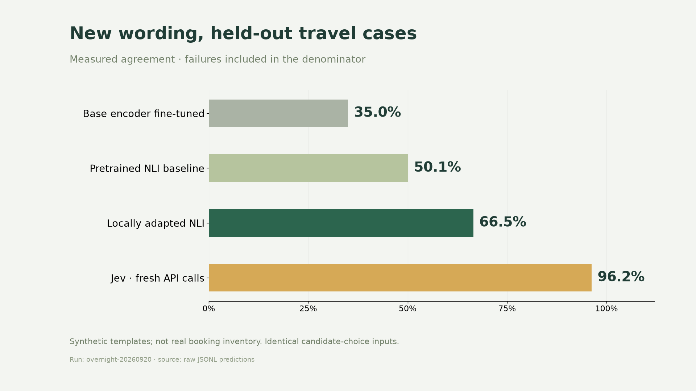

# Measurements with their boundaries

## Frozen later travel challenger

| Engine | Reference agreement | Judgments |
|---|---:|---:|
| Local V2 |95.28%|1,440|
| Jev |98.61%|1,440|

Both saw the same 360 synthetic travel scenarios. The paired difference was −3.33 percentage points, with a scenario-bootstrap 95% interval [−4.38, −2.29]. This challenger did not beat Jev and was not promoted. Conditional replication was not launched after the failed superiority gate. No final-error tuning followed.

Reference answers were synthetic and agent-reviewed, not human-validated hotel facts. Full repairs, original drafts and two non-unanimous writer-assisted adjudications are retained in the companion artifact.

## The model the live agency runs

Since 22 September 2026 the live agency runs V2 under a separate app rule: it passed the fresh-round quality and coverage gates and clearly beats the earlier V1 on the same round. On the same 360 scenarios, with both models frozen before the corpus existed and nothing tuned: V1 60.28%, V2 95.28%, Jev 98.61%. V2 minus V1 is +35.0 points (95% scenario bootstrap 32.5 to 37.5). Median model time per scenario: V1 144 ms, V2 99 ms. This is not a Jev win.

V1 separately scored 66.5% on its own older travel test, shown below as history.

## Generalization

V2 public workflow agreement was 34.05% versus 73.65% for Jev; 35/2000 local decisions failed the frozen context limit and stayed in the denominator. Public classification was 49.67% versus 76.33%. These are normalized candidate-choice adapters, not the official native benchmark harness. Upstream data exposure may apply.

## Latency

V2 warm local tokenization/inference median 98.6 ms; Jev remote request median 165.6 ms. These measure different deployment boundaries. Loading and browser rendering are excluded. The separate photo-aware 40-offer scan took 40.7 seconds in one recorded run. No universal speed comparison is claimed.

## Image evidence

Nine actual image inferences and a causal photo-toggle check establish that pixels enter the decision path. They do not establish broad image accuracy. Images are generated and shared by destination. The 0.8 visual threshold is a heuristic, not calibrated confidence.

Raw summaries and integration receipts are in ../evidence. The versioned companion release retains raw evaluation rows, failures, hashes and both text checkpoints.
